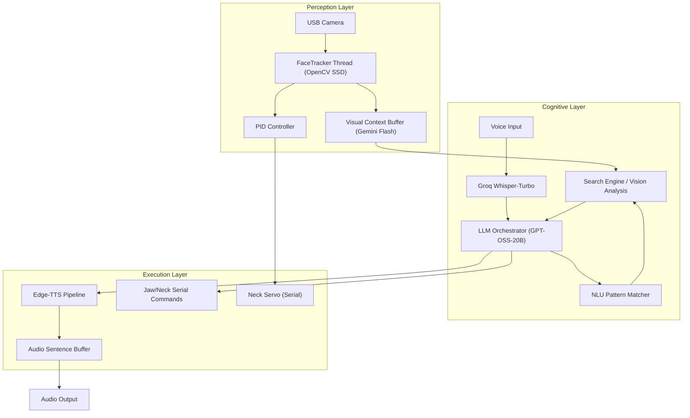

# Nova: An Integrated AI Stack for InMoov Humanoids

Nova is an experimental software framework designed to bridge multi-modal Large Language Models (LLMs) with the **InMoov** open-source robotics platform. Rather than a "fully autonomous" system, Nova is an integration layer that explores interactive robotics through cloud-mediated perception and low-latency reasoning.

---

## 🤝 Partners & Acknowledgments

This research is made possible through the support of industry partners providing the core infrastructure for Nova:

- **[Radxa](https://radxa.com)**: Provided the **ROCK 5C** high-performance SBC, serving as the primary compute node for local vision processing and serial orchestration.
- **[DFRobot](https://www.dfrobot.com)**: Provided the electronic ecosystem, including high-torque servos for articulation and **Mega2560** controllers for hardware-level interface.
- **[Polymaker](https://polymaker.com)**: Provided advanced **PLA+** filaments, ensuring the structural integrity and durability of the 3D-printed humanoid frame.

---

> [!NOTE]
> This project is a technical experiment in robotics integration. It is subject to network latency, mechanical variance, and the probabilistic nature of LLMs.

## 🏗️ System Architecture

Nova operates across three primary domains: **Physical Control**, **Real-time Perception**, and **Cognitive Orchestration**. These domains are synchronized through a multi-threaded Python core.

### Architecture Overview


### Key Components
- **`FaceTracker` (Threaded)**: Employs a Caffe-based SSD detector to maintain low-latency gaze tracking. PID loops calculate servo trajectories to minimize jitter.
- **`Animatronic` Module**: Manages the serial ACK/NAK flow control protocol with Arduino Mega. It synchronized Edge-TTS audio streams with heuristic jaw movements.
- **`LLM Orchestrator`**: Routes prompts through Groq (for conversation) and Gemini 2.0 Flash (for visual reasoning). It uses regex-based NLU to trigger functional calls like `#VISUAL` or `#SEARCH`.

---

## 🛠️ Technical Design & Rationale

| Choice | Rationale | Trade-off |
| :--- | :--- | :--- |
| **Groq (Llama-3/20B)** | Chosen for <500ms TTFT (Time To First Token) to maintain conversational flow. | Dependency on cloud infrastructure and API availability. |
| **Gemini 2.0 Flash** | Native multi-modal support allows for direct image-to-text analysis without separate captioning models. | Higher latency than local vision; requires active internet connection. |
| **Edge-TTS** | High-fidelity neural voices without the overhead of local WaveNet models. | Slightly higher latency than simple eSpeak; requires internet. |
| **PID Gaze Control** | Prevents aggressive servo "hunting" and provides smoother humanoid-like motion. | Requires manual tuning for different servo hardware. |

---

## ⚠️ Known Limitations & Failure Modes

Robotics at this scale is inherently prone to failure. Nova acknowledges the following:

- **Network Latency**: While Groq is fast, the total loop (STT -> LLM -> TTS) still introduces 1.5s-3s of delay, which can break the illusion of real-time presence.
- **Perception Blindspots**: The SSD face detector struggles in low-light environments and can lose tracking if the user moves outside of a 60° FOV.
- **Servo Saturation**: Standard hobby servos (MG996R) have significant deadbands and gear backlash, leading to occasional mechanical jitter.
- **Context Drift**: The current short-term memory is limited by token windows; long-term memory use `long_term_memory_converter()` but is still experimental.

---

## 📦 Getting Started

### Prerequisites
- **Hardware**: InMoov Head/Neck assembly, Arduino Mega, USB Webcam, Microphone.
- **Software**: Python 3.12+, `ffmpeg`, Groq & Google Generative AI API Keys.

### Installation
1. Clone the repository:
   ```bash
   git clone https://github.com/alexbuildstech/nova.git
   cd nova
   ```
2. Install dependencies:
   ```bash
   pip install -r requirements.txt
   ```
3. Configure your environment:
   Edit `config.py` with your API keys and hardware ports.

---

## 🧬 Iteration & Reflection

Nova started as a simple local script using `vosk` and `ollama`, but transitioned to a cloud-hybrid stack to achieve the speed required for humanoid interaction. The biggest challenge was not the AI itself, but the **synchronization of physical movement with synthetic voice**.

Future iterations aim to move the vision loop to local Jetson-based inference to reduce dependency on the Gemini API for basic object presence.

---

*Keywords: Robotics, Humanoid, LLM Integration, Computer Vision, InMoov, OpenCV, PID Control, Edge-TTS, Groq, Gemini.*
